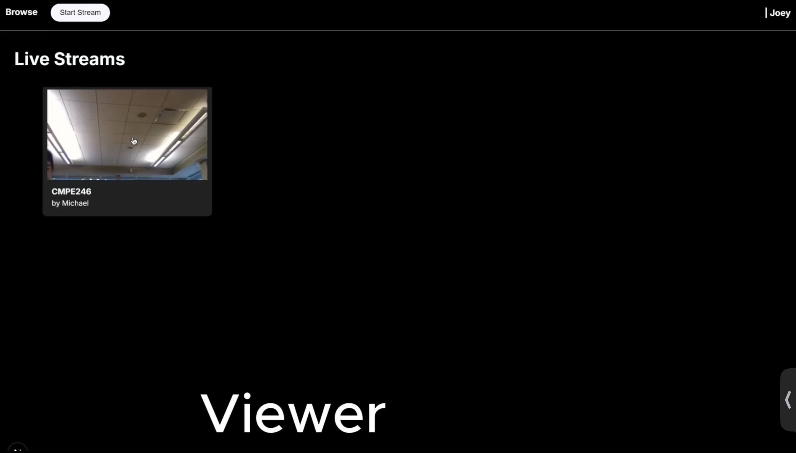

# 🛠 💻 ⚡️ Michael Zhang – Engineering Portfolio

Welcome to my project portfolio. I’m a Computer Engineering student at the University of British Columbia, passionate about solving real-world problems through a blend of **software engineering**, **hardware integration**, and **intelligent systems design**.

This repository showcases a curated set of my technical projects. Each project demonstrates a unique combination of skills in system architecture, embedded development, robotics, data engineering, and full-stack implementation. All projects are based on **real, hands-on experience**—with documented code, visuals, and outcomes.

---

## 💡 Key Technical Competencies

| Domain                | Skills & Tools                                                   |
|----------------------|------------------------------------------------------------------|
| **Embedded Systems** | Arduino, Raspberry Pi, GPIO, PWM, sensor integration             |
| **Software Development** | TypeScript, Python, Node.js, React, REST APIs, WebSocket    |
| **Streaming & Real-Time Apps** | HLS, FFmpeg, Ant Media Server, Docker                 |
| **Robotics & Perception** | ROS2, Jetson Nano, YOLOv5, computer vision pipelines       |
| **Data & Infrastructure** | MongoDB, Prisma, GitHub Actions, data pipelines           |
| **CAD & Hardware Design** | SolidWorks, breadboarding, prototyping, debugging          |

---

## 🚀 Featured Projects

### 📡 OpenStream – Distributed Video Streaming Platform

Designed and implemented a full-stack distributed video streaming platform using Next.js, WebSocket, and Ant Media Server, featuring real-time broadcasting, HLS playback, session management with MongoDB, and containerized deployment on a Kubernetes Raspberry Pi cluster.

🔧 Tech Stack
- Frontend / UI
  - Next.js (React + TypeScript)
  - Tailwind CSS or your CSS framework (if used)
  - Streaming / Media
  - Ant Media Server (WebRTC + HLS broadcasting
  - FFmpeg (for encoding/transcoding)
  - HLS.js (if used for client playback in-browser)
- Backend / Infrastructure
  - Node.js API layer (inside Next.js)
  - WebSocket (real-time messaging / session control)
  - Prisma (ORM for MongoDB)
  - MongoDB (session/user metadata storage)
- DevOps / Deployment
  - Docker (containerization)
  - Docker Compose (if used to orchestrate services)
  - Raspberry Pi Cluster (for distributed load-balanced deployment)

- 🎯 Highlights:
  - Architected and deployed a full-stack streaming platform with support for multi-user session management, real-time video delivery, and WebSocket-based chat
  - Integrated Ant Media Server and FFmpeg into a containerized pipeline for live and HLS-based playback
  - Built dynamic user session handling with MongoDB and Prisma ORM

- 🔍 Skills Applied:
  - Full-stack system design (Next.js, Node.js, WebSocket)
  - Containerization and deployment using Docker
  - Real-time media streaming (WebRTC, HLS, FFmpeg)
  - Session and data modeling with MongoDB & Prisma
  - Low-latency communication over WebSocket and API endpoints

[Project Details ➜](https://github.com/superbolt08/OpenStream/blob/main)

---

🧮 FPGA 4-bit Adder/Subtractor in Verilog – APSC 262 Digital Logic Lab Project

Designed and implemented a 4-bit signed binary calculator in Verilog, capable of performing addition and subtraction using modular design principles (half adders, full adders, and ripple-carry logic).

- ⚙️ Components:
  - Half Adder (HA), Full Adder (FA), Ripple-Carry Adder (RCA)
  - Adder/Subtractor with XOR-based 2’s complement logic
- 🧰 Tools:
  - Intel Quartus II
  - Altera DE1 Cyclone II FPGA development board
  - Verilog HDL
- ✅ Functionality:
  - Performs signed 4-bit binary addition and subtraction
  - Detects overflow conditions in arithmetic operations
  - Modular structure promotes design reuse and testability
- 💡 Learning Outcome:
  - Developed hands-on understanding of arithmetic logic design
  - Practiced modular coding and verification in hardware
  - Gained insight into 2’s complement arithmetic and overflow detection in digital systems

[Project Details ➜](https://github.com/sdhfgfhgf/4-bit-Adder-Subtractor/tree/main)

---

⏱️ FPGA BCD Counter System in Verilog – APSC 262 Digital Logic Lab Project

Designed and implemented a Binary-Coded Decimal (BCD) counter system featuring both approximate and precision-timed versions. The design displays real-time second, tenth-second, and hundredth-second counts using a 50 MHz base clock on an Altera DE1 board.

- ⚙️ Features:
  - Real-time 3-digit and 4-digit BCD output on 7-segment displays
  - Pushbutton-based active-low reset
  - Modular Verilog design with reusable 7-segment decoder module
- 🧰 Tools:
  - Verilog HDL
  - Quartus II
  - Altera DE1 Cyclone II FPGA development board
- 💡 Concepts:
  - Synchronous design using always blocks and non-blocking assignments
  - Timing accuracy via bit-width calculation: 2^x × 20ns ≈ 0.01s → x ≈ 19
  - BCD cascading logic and 7-segment display encoding

[Project Details ➜](https://github.com/sdhfgfhgf/fpga-bcd-timer/tree/main)

---

### 🎯 Object Detection for AUV Navigation – Okanagan Marine Robotics

Developed and deployed machine learning inference for underwater robotic navigation, with real-time vision-based detection.

- 🧠 Tools:
  - YOLOv5
  - PyTorch
  - NVIDIA Jetson Nano
  - ROS2
  - OpenCV
- 🛠 Contributions:
  - Optimized custom object detection models
  - Integrated ML pipeline into a live robotic ROS2 environment
  - Visualized detections for operator feedback
- 💡 Application: Real-time mission-critical robotics control

[Project Details ➜](https://github.com/Okanagan-Marine-Robotics/okmr_auv)

---

👥 Group Management System – C++ OOP Project

A robust C++ application for managing group membership, developed independently with a focus on object-oriented programming, dynamic memory control, and efficient data operations.
- 🧩 Features:
  - Add, remove, update, and view member details
  - Search and sort functionalities with high performance
  - Command-line interface with real-time feedback
  - 🧠 Techniques Used:
  - Polymorphism, inheritance, encapsulation
  - Pointer-based memory management and reference optimization
  - Modular design with clean separation of logic and UI
- 📊 Impact:
  - Reduced manual tracking by over 40%
  - Designed for scalability and reusability in future team-based projects
- 📅 Duration: June – August 2024

[Project Details ➜](https://github.com/sdhfgfhgf/Group-Management-System)

---

## 📂 Other Projects (Coming Soon)

- **IoT Temperature Logger with Cloud Sync** – Sensor-driven data pipeline to remote dashboard (Node.js + MQTT + MongoDB)
- **Dynamic Resume Generator CLI Tool** – Python script that generates customized resume versions using YAML profiles
- **Basic FPGA-Based Counter Design (in SystemVerilog)** – Synchronous counter with reset and enable logic

---

## 📄 [Download My Resume](https://www.dropbox.com/scl/fi/2f9vepmdo2c6utypyvvug/Michael-Zhang-CO-OP-Resume.pdf?rlkey=5uzeh0tdvxjb7pgp2di3kd5mv&st=fu1tlwxm&dl=0)

---

## 📬 Contact

- **Email**: michaelzhang5528@gmail.com  
- **LinkedIn**: [linkedin.com/in/michael-zhang-mkz](http://www.linkedin.com/in/micheal-zhang-mkz)  
- **GitHub**: [github.com/sdhfgfhgf](http://www.github.com/sdhfgfhgf)

---
